# HarvestConnect Buyer App — Architecture

## 1. System Layers Overview

```
┌─────────────────────────────────────────────────────────────────────────────┐
│                          PRESENTATION LAYER                                  │
│                      13 Screens  ·  expo-router v5                           │
│  ┌─────────────────────────────────────────────────────────────────────────┐ │
│  │  TABS                                                                   │ │
│  │  Home · Explore · Cart · Orders · Profile                               │ │
│  ├─────────────────────────────────────────────────────────────────────────┤ │
│  │  STACK SCREENS                                                          │ │
│  │  Search · Checkout · Order Confirmed · Product Detail                   │ │
│  │  Category · Order Detail · Address Book · Address Form                  │ │
│  └─────────────────────────────────────────────────────────────────────────┘ │
└───────────────────────────────┬─────────────────────────────────────────────┘
                                │ reads / writes
                                ▼
┌─────────────────────────────────────────────────────────────────────────────┐
│                          COMPONENT LAYER                                     │
│  CartButton · TrustBadge · ShippabilityBadge · RangoliBorder                │
│  PressableScale · AppTabs                                                    │
└───────────────────────────────┬─────────────────────────────────────────────┘
                                │
          ┌─────────────────────┼─────────────────────┐
          ▼                     ▼                     ▼
┌───────────────────┐ ┌──────────────────┐ ┌──────────────────────────────────┐
│   STATE LAYER     │ │   STATE LAYER    │ │        STATE LAYER               │
│   Cart Store      │ │  Orders Store    │ │       User Store                 │
│  (Zustand v5)     │ │  (Zustand v5)    │ │      (Zustand v5)                │
└────────┬──────────┘ └───────┬──────────┘ └──────────────────────────────────┘
         │                    │
         └──────────┬─────────┘
                    │ async calls
                    ▼
┌─────────────────────────────────────────────────────────────────────────────┐
│                          SERVICE LAYER                                       │
│     Products Service · Orders Service · Search Service                      │
└───────────────────────┬─────────────────────────────────────────────────────┘
                        │ HTTP / local
             ┌──────────┴──────────┐
             ▼                     ▼
  ┌──────────────────┐   ┌────────────────────┐
  │  Catalog API     │   │    Mock Data        │
  │ localhost:3003   │   │  src/data/mock.ts   │
  │  /v1/products    │   │  products (9)       │
  │  /v1/products/id │   │  categories (5)     │
  └──────────────────┘   │  vendors (3)        │
                         │  regions (4)         │
                         │  orders (3)          │
                         └────────────────────┘
```

---

## 2. Full Dependency Map (Mermaid)

> Paste into https://mermaid.live to render

```mermaid
graph TD
    %% ── Screens ──────────────────────────────────────────────
    HOME["🏠 Home\n(tabs)/index.tsx"]
    EXPLORE["🔍 Explore\n(tabs)/explore.tsx"]
    CART["🛒 Cart\n(tabs)/cart.tsx"]
    ORDERS["📦 Orders\n(tabs)/orders.tsx"]
    PROFILE["👤 Profile\n(tabs)/profile.tsx"]
    SEARCH["🔎 Search\nsearch.tsx"]
    CHECKOUT["💳 Checkout\ncheckout.tsx"]
    CONFIRMED["✅ Order Confirmed\norder-confirmed.tsx"]
    PRODUCT["📄 Product Detail\nproduct/[id].tsx"]
    CATEGORY["📂 Category\ncategory/[id].tsx"]
    ORDER_D["🗂 Order Detail\norder/[id].tsx"]
    ADDR_BOOK["📍 Address Book\naddress-book.tsx"]
    ADDR_FORM["✏️ Address Form\naddress-form.tsx"]

    %% ── Components ───────────────────────────────────────────
    CARTBTN["CartButton\ncart-button.tsx"]
    BADGES["TrustBadge · ShippabilityBadge\nbuyer-ui.tsx"]

    %% ── Stores ───────────────────────────────────────────────
    CART_S[("🗃 Cart Store\nitems · qty · subtotal")]
    ORDER_S[("🗃 Orders Store\nplacedOrders[]")]
    USER_S[("🗃 User Store\nprofile · addresses")]

    %% ── Services ─────────────────────────────────────────────
    PROD_SVC["⚙️ Products Service\nproducts.ts"]
    ORDER_SVC["⚙️ Orders Service\norders.ts"]
    SEARCH_SVC["⚙️ Search Service\nsearch.ts"]

    %% ── Data ─────────────────────────────────────────────────
    API[("🌐 Catalog API\nlocalhost:3003")]
    MOCK[("📁 Mock Data\ndata/mock.ts")]

    %% ── Screen → Store connections ───────────────────────────
    HOME --> USER_S
    HOME --> CARTBTN
    EXPLORE --> CARTBTN
    CART --> CART_S
    CART --> USER_S
    ORDERS --> ORDER_S
    PROFILE --> USER_S
    PROFILE --> CART_S
    CHECKOUT --> CART_S
    CHECKOUT --> ORDER_S
    CHECKOUT --> USER_S
    CONFIRMED --> ORDER_S
    PRODUCT --> CART_S
    ADDR_BOOK --> USER_S
    ADDR_FORM --> USER_S

    %% ── Component → Store ────────────────────────────────────
    CARTBTN --> CART_S

    %% ── Screen → Service connections ─────────────────────────
    HOME --> PROD_SVC
    EXPLORE --> PROD_SVC
    SEARCH --> SEARCH_SVC
    PRODUCT --> PROD_SVC
    CATEGORY --> PROD_SVC
    ORDERS --> ORDER_SVC
    ORDER_D --> ORDER_SVC
    ORDER_D --> ORDER_S

    %% ── Screen → Component ───────────────────────────────────
    HOME --> BADGES
    EXPLORE --> BADGES
    SEARCH --> BADGES
    CATEGORY --> BADGES

    %% ── Service → Data ───────────────────────────────────────
    PROD_SVC -->|"HTTP GET /v1/products"| API
    PROD_SVC -->|fallback| MOCK
    ORDER_SVC --> MOCK
    SEARCH_SVC --> MOCK

    %% ── Store interactions ───────────────────────────────────
    CHECKOUT -->|"placeOrder()"| ORDER_S
    CHECKOUT -->|"clearCart()"| CART_S
```



---

## 3. Screen Navigation Map

```
                           ┌─────────┐
                           │  _layout │  Root Stack
                           └────┬────┘
                                │
              ┌─────────────────┼──────────────────────────┐
              │                 │                          │
         ┌────▼─────┐    ┌──────▼───────┐          other stack screens
         │  (tabs)   │    │  Stack screens│
         └────┬─────┘    └──────┬────────┘
              │                  │
   ┌──────────┼──────────┐       ├── /search
   │     5 Tabs           │       ├── /checkout ──► /order-confirmed
   │                      │       ├── /product/[id]
  Home  Explore  Cart     │       ├── /category/[id]
  Orders  Profile         │       ├── /order/[id]
              │           │       ├── /address-book
              │           │       └── /address-form
              │           │
   Navigation arrows:
   Home ──────────────────────────► /product/[id]
   Home ──────────────────────────► /category/[id]
   Home ──────────────────────────► /search
   Explore ────────────────────────► /product/[id]
   Category ───────────────────────► /product/[id]
   Cart ───────────────────────────► /address-book ─► /address-form
   Cart ───────────────────────────► /checkout ──────► /order-confirmed
   Orders ─────────────────────────► /order/[id]
   Order Confirmed ────────────────► /orders
   Order Confirmed ────────────────► / (home)
```

---

## 4. Data Flow — Checkout (Critical Path)

```
User on Cart screen
        │
        │  taps "Proceed to Checkout"
        ▼
   Checkout Screen
        │
        ├── reads  Cart Store  ──────► items[], subtotal
        ├── reads  User Store  ──────► selectedAddress
        │
        │  user selects slot + payment, taps "Place Order"
        ▼
   handlePlaceOrder()
        │
        ├── Orders Store.placeOrder({items, subtotal, delivery, total, address})
        │        └── generates orderId = "GS" + timestamp
        │        └── appends PlacedOrder to orders[]
        │
        ├── Cart Store.clearCart()
        │
        └── router.replace("/order-confirmed?orderId=GS...")
                │
                ▼
         Order Confirmed Screen
                │
                └── Orders Store.getById(orderId)  ──► displays summary
```

---

## 5. Data Flow — Region Filter (Explore)

```
Explore Screen mounts
        │
        ├── getProducts()   ──────► Products Service
        │       │                        │
        │       │          HTTP GET      ▼
        │       │     ┌─► Catalog API /v1/products
        │       │     │         │
        │       │     │     map CatalogProduct → Product
        │       │     │
        │       │     └─► (on error) Mock Data fallback
        │       │
        └── setAllProducts(products[])
                │
                │   user taps region pill (mandal / district / state / national)
                ▼
        setSelectedRegion(regionId)
                │
         ┌──────▼──────────────────────────────────────────┐
         │  filtered = allProducts.filter(                  │
         │    p => p.shippability === selectedRegion        │
         │  )                                               │
         │  countFor(r) = allProducts.filter(...).length    │
         └──────────────────────────────────────────────────┘
                │
                ▼  renders filtered cards (instant, no re-fetch)
```

---

## 6. State Store Reference

### Cart Store  (`src/store/cart.ts`)
| State | Type | Initial |
|---|---|---|
| `items` | `CartItem[]` | Seeded: p1(×2), p3(×3), p8(×1) |

| Action | Effect |
|---|---|
| `addItem(product, qty?)` | Add or increment existing item |
| `removeItem(productId)` | Remove item completely |
| `updateQty(productId, delta)` | ±1, min qty = 1 |
| `clearCart()` | Empty items array |
| `cartSubtotal` *(selector)* | Sum of price × qty |
| `cartItemCount` *(selector)* | Sum of all quantities |

### Orders Store  (`src/store/orders.ts`)
| State | Type | Initial |
|---|---|---|
| `orders` | `PlacedOrder[]` | `[]` |

| Action | Effect |
|---|---|
| `placeOrder(data)` | Creates order, returns `orderId` |
| `getById(id)` | Returns matching `PlacedOrder` or `undefined` |

### User Store  (`src/store/user.ts`)
| State | Type | Initial |
|---|---|---|
| `name / phone / initials` | string | "Rajesh Kumar" |
| `location / district` | string | "Kukatpally / Medchal" |
| `walletBalance` | number | ₹250 |
| `addresses` | `Address[]` | 1 Home address |
| `selectedAddressId` | string | `"addr-1"` |

| Action | Effect |
|---|---|
| `addAddress(addr)` | Add, optionally set as default |
| `updateAddress(id, patch)` | Patch fields, handles default flag |
| `deleteAddress(id)` | Remove, auto-select fallback |
| `setSelectedAddress(id)` | Set delivery address |
| `addToWallet(amount)` | Increment wallet balance |

---

## 7. Service API Reference

### Products Service  (`src/services/products.ts`)
| Function | Endpoint | Fallback |
|---|---|---|
| `getProducts(regionId?)` | `GET /v1/products` | Mock products |
| `getProductById(id)` | `GET /v1/products/:id` | `null` on 404 |
| `getFeaturedProducts()` | `GET /v1/products` → top 6 by rating | Mock |
| `getProductsByCategory(id)` | `GET /v1/products?category=id` | Mock keyword filter |
| `getCategories()` | — | Mock categories (always) |
| `getVendors()` | — | Mock vendors (always) |

> **Mapping:** `CatalogProduct` (API) → `Product` (app type)
> Price divided by 100 (cents → rupees), badges built from `isVerified`/`isHandmade`/`shipsTo`

### Orders Service  (`src/services/orders.ts`)
| Function | Source | Delay |
|---|---|---|
| `getOrders()` | Mock data | 200ms |
| `getOrdersByStatus(status)` | Mock filtered | 200ms |
| `getOrderById(id)` | Mock single | 120ms |

### Search Service  (`src/services/search.ts`)  *(Phase 1)*
| Function | Source | Notes |
|---|---|---|
| `searchProducts(query)` | Mock products | Relevance: name=3, vendor/category=2, description=1 |

> **Phase 2 plan:** Replace body with Elasticsearch hybrid BM25 + k-NN query

---

## 8. Key Architectural Decisions

| Decision | Choice | Reason |
|---|---|---|
| Navigation | expo-router Stack + Tabs | File-based routing, typed routes |
| State | Zustand v5 (3 stores) | Minimal boilerplate, fine-grained subscriptions |
| Non-tab screens | Root Stack, not inside (tabs) | TabSlot only renders tab routes |
| API host (Android) | `10.0.2.2:3003` | Android emulator alias for host machine |
| Region filtering | Client-side after single fetch | Instant switching, no extra round-trips |
| CartButton | Self-contained component | Each card doesn't need cart state in parent |
| Address management | Zustand (in-memory) | No backend yet; structured for future persistence |
| Search Phase 1 | Mock keyword scoring | Ships fast; Phase 2 drops in ES without changing callers |
| API fallback | Catch → mock data | Screens always show content even when backend is down |
